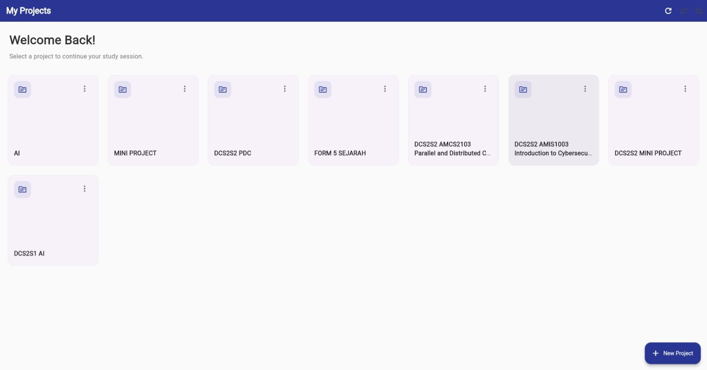
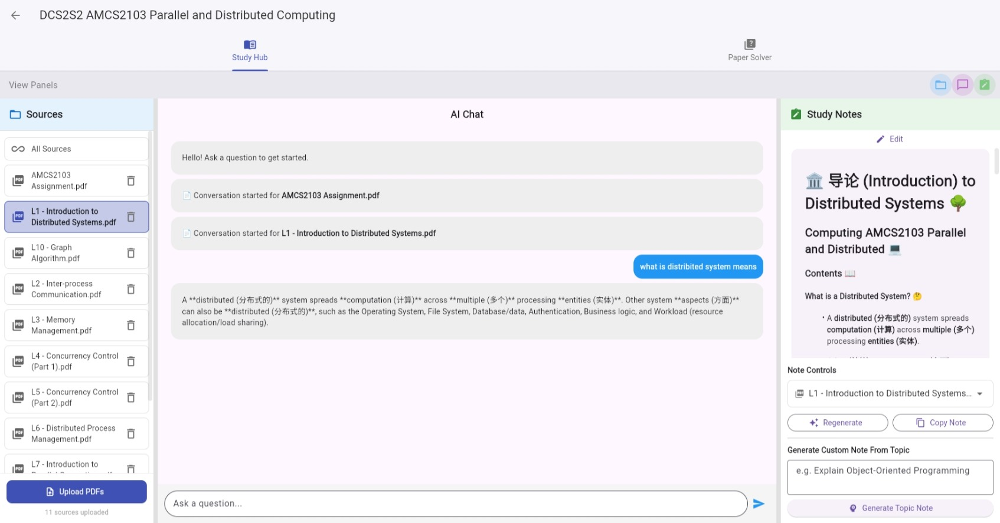
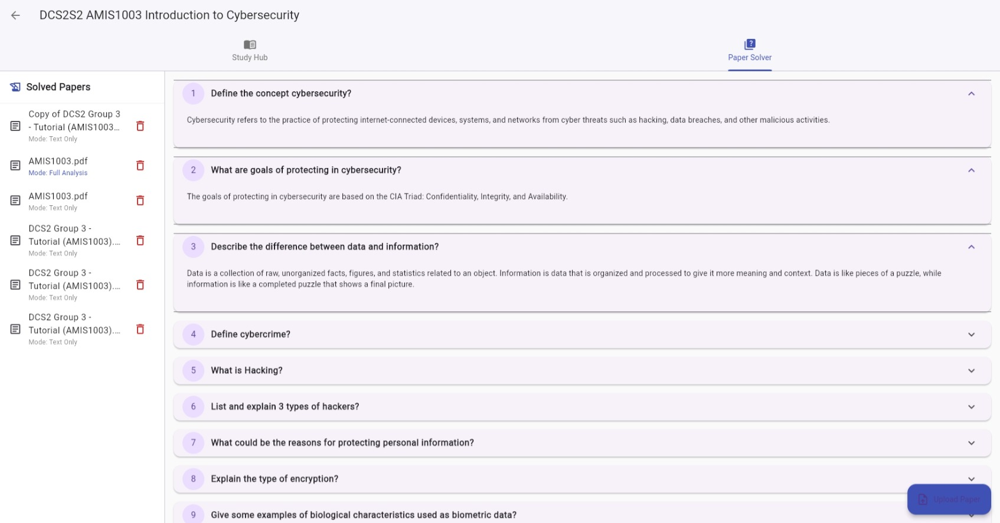
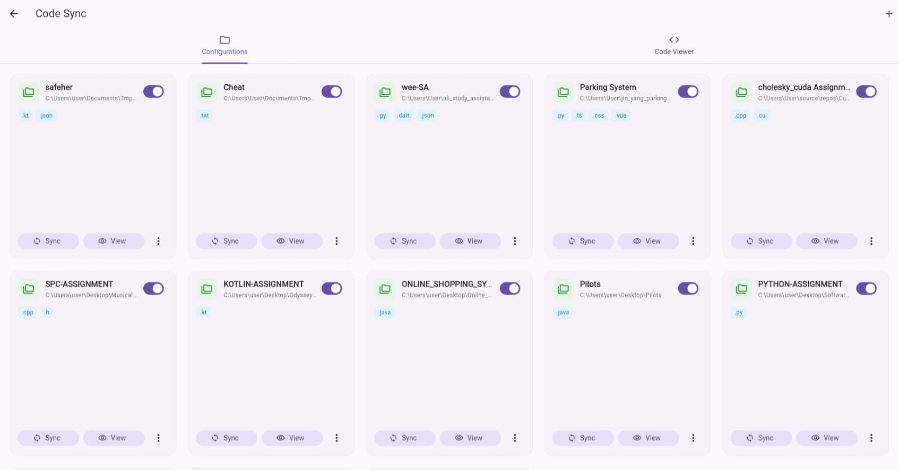
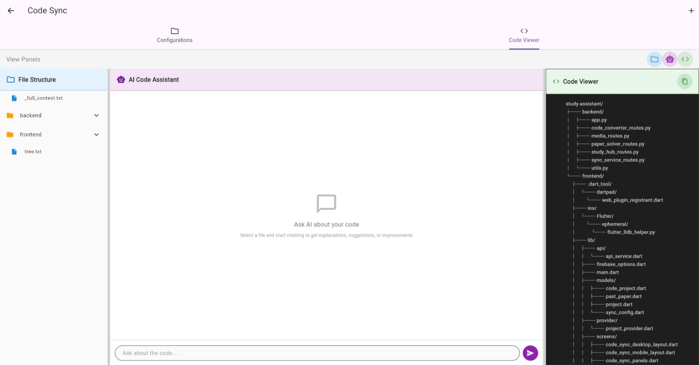

# Study Assistant



A Flutter-based study assistant application that helps users manage their study schedules, notes, and resources.

## Features
- Manage study tasks and deadlines
- Organize notes with rich text formatting
- Track progress with visual charts
- Sync data across devices (future feature)

## Getting Started

### Prerequisites
- Flutter SDK (stable channel) – [Installation Guide](https://flutter.dev/docs/get-started/install)
- Android Studio / VS Code with Flutter extensions (for IDE support)
- A device or emulator for testing

### Installation
```bash
# Clone the repository
git clone https://github.com/your-username/study-assistant.git

# Navigate to the project directory
cd study-assistant

# Get Flutter dependencies
flutter pub get
```

## Running the App
```bash
# Run on a connected device or emulator
flutter run
```

## Building for Release
```bash
# Build Android APK
flutter build apk --release

# Build iOS (requires macOS)
flutter build ios --release
```

## Contributing
Contributions are welcome! Please fork the repository and submit a pull request.

1. Create a new branch for your feature or bug fix.
2. Ensure code follows existing style conventions.
3. Write tests for new functionality.
4. Update documentation as needed.

## License
This project is licensed under the MIT License – see the [LICENSE](LICENSE) file for details.

## 📸 Screenshots & Features

### Your Central Hub: The Project Dashboard


The **Project Dashboard** is the first thing you see when you log in. It's designed to be clean and distraction-free:

*   **Welcome Back:** Get a quick overview of all your projects in one place.
*   **Easy Navigation:** Select any project card to jump right back into your study session.
*   **Organized View:** Each subject or project, like `AI`, `FORM 5 SEJARAH`, or `DCS2S2 MINI PROJECT`, is neatly organized as a card.
*   **Create on the Fly:** The `+ New Project` button makes it simple to start a new study topic whenever inspiration strikes.

---

### 🧠 Your Intelligent Study Hub



Once you select a project, you're brought to the **Study Hub**, your all-in-one workspace designed for focused learning and efficient information retrieval. The screen is logically divided into three powerful panels:

#### 📚 1. Source Management (Left Panel)

This is your personal library for the project. You have complete control over the knowledge base the AI will use.

*   **Upload Your Materials:** Easily upload all relevant study materials, such as lecture notes, textbooks, and articles in PDF format.
*   **Context-Aware Chat:** Select a specific document (like `L1 - Introduction to Distributed Systems.pdf`) to have the AI focus its conversation and note-generation on that single source.
*   **All Sources View:** Chat with the AI using the combined knowledge of all uploaded documents for comprehensive answers.

#### 🤖 2. Interactive AI Chat (Center Panel)

This is your personal tutor that has read all of your study materials and is ready to help.

*   **Ask Anything:** Pose complex questions or ask for simple definitions (e.g., "what does a distributed system mean?"). The AI scans your uploaded sources to provide accurate, context-aware answers.
*   **Conversation History:** Keep track of your line of questioning with a clear, threaded chat history.

#### 📝 3. AI-Generated Study Notes (Right Panel)

This is where your study session becomes truly productive. The AI doesn't just answer questions; it actively helps you create study materials.

*   **Automatic Summarization:** The app automatically generates structured, easy-to-read study notes based on the content of your source documents.
*   **Dynamic Note Controls:** `Regenerate` notes for a fresh perspective or `Copy Note` to paste them into your favorite note-taking app.
*   **Custom Topic Generation:** Need to understand a specific concept in more detail? Use the "Generate Custom Note From Topic" feature to create focused notes on-demand.

---

### 📝 Paper Solver: Conquer Tutorials and Exams



The **Paper Solver** tab is the ultimate preparation tool, transforming tedious manual work into instant, accurate solutions. Stop hunting through notes and start reviewing the answers you need.

#### 🚀 How It Works:

1.  **Upload Papers:** Simply upload any PDF document containing tutorial questions, lab sheets, or past year examination papers.
2.  **Instant Solving:** The system analyzes the questions and generates accurate answers using the collective knowledge gathered in your **Study Hub** materials.

#### ✨ Key Features:

*   **Accordion View:** Questions and answers are displayed in a clean, collapsible accordion format, allowing you to focus on one question at a time.
    *   *Example:* Answers to complex questions like "Define the concept cybersecurity?" and "Describe the difference between data and information?" are instantly available.
*   **Archived Solutions:** All previously solved papers are archived in the left panel, making it easy to return to previous study sessions and review solutions at any time.
*   **Flexible Solving Modes:** Papers can be solved using different modes (e.g., *Full Analysis* or *Text Only*), adapting to your study needs and required depth of detail.
*   **Focus on Review:** By automating the answering process, the Paper Solver allows you to spend less time finding information and more time understanding and internalizing the solutions, guaranteeing better exam preparation.

---

### 💻 Code Sync: Your Coding Projects, Instantly Accessible



The **Code Sync** feature solves one of the biggest headaches for students: managing code files across multiple machines and ensuring your latest version is always available for study or presentation.

#### 🔄 Seamless Synchronization:

This screen acts as your central control panel for all code-related assignments and projects.

*   **Project Cards:** Each card represents a locally stored project (e.g., `Parking System`, `PYTHON-ASSIGNMENT`, `KOTLIN-ASSIGNMENT`), displaying the file path and the languages used (`.py`, `.ts`, `.cpp`, `.java`).
*   **One-Click Sync:** The `Sync` button allows you to instantly synchronize the selected project's files with your cloud storage, guaranteeing that your latest changes are backed up and accessible.
*   **Toggle Visibility:** Easily enable or disable synchronization for any project using the toggle switch.

#### 💡 Key Benefits:

*   **View Code Anywhere:** Use the `View` button to open the project's code directly within the app (via the "Code Viewer" tab), eliminating the need to switch to a separate IDE or file explorer just to review a function or class.
*   **Multi-Language Support:** The system automatically recognizes and manages various file types, from Python (`.py`) and Kotlin (`.kt`) to C++ (`.cpp`) and web files (`.vue`, `.css`).
*   **Organized Development:** Maintain a clean, visual history of all your active coding projects, ensuring no assignment ever gets lost or forgotten.

---

### 💬 AI Code Assistant: Instant Programming Help



When you open a synchronized code project, you are presented with the **AI Code Assistant**. This integrated environment brings code visualization and intelligent help together, eliminating context-switching and saving hours of frustration.

#### 🔭 1. Code Viewer (Right Panel)

This panel provides an organized, hierarchical view of your entire synchronized project structure.

*   **File Tree Visualization:** Quickly navigate large projects with a clear, visual representation of files and folders (e.g., `backend/`, `frontend/`, `study_hub_routes.py`).
*   **Integrated Viewing:** Any file selected from the "File Structure" panel on the left is displayed instantly here, allowing for immediate code review without leaving the application.

#### 🤖 2. AI Code Assistant (Center Panel)

This is the most powerful tool for every coding student, offering real-time, context-aware assistance based on the code you are currently viewing.

*   **Code Explanation:** Select a complex file or function, and ask the AI to **"Explain this code to me"** or **"What does this function do?"**
*   **Debugging and Suggestions:** Having trouble with an error? Upload the file and ask the AI for potential fixes, suggestions for optimization, or alternative implementations.
*   **Contextual Chat:** The chat environment is primed with the contents of your code, ensuring the AI's responses are always relevant to your project architecture and current task.

This seamless integration ensures that whether you're studying concepts in the Study Hub or debugging code in the Code Assistant, your intelligent companion is always ready to guide you to the solution.

***

### 🌐 Summary of Key Features

*   **Project Dashboard:** Centralized management for all study sessions and coding projects.
*   **Study Hub:** AI-powered Q&A and instant note generation from uploaded PDFs.
*   **Paper Solver:** Automated solving of tutorial questions and past papers.
*   **Code Sync & Assistant:** Seamless synchronization of local code projects with integrated, context-aware AI help.